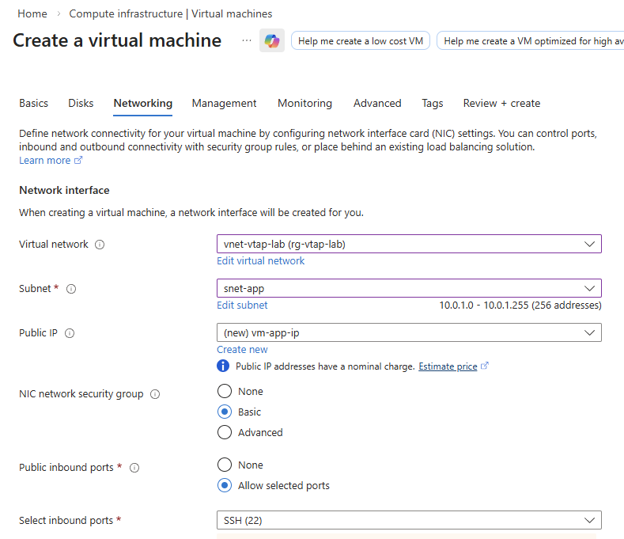
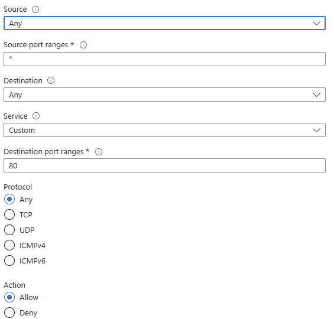
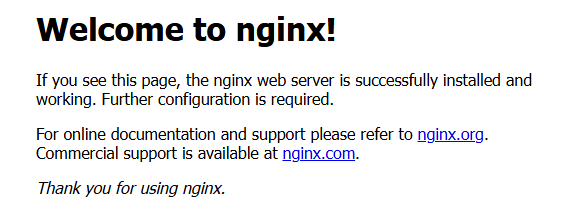
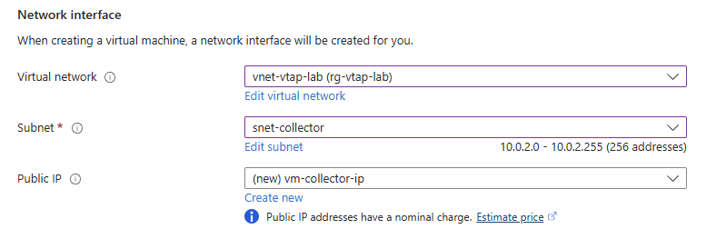
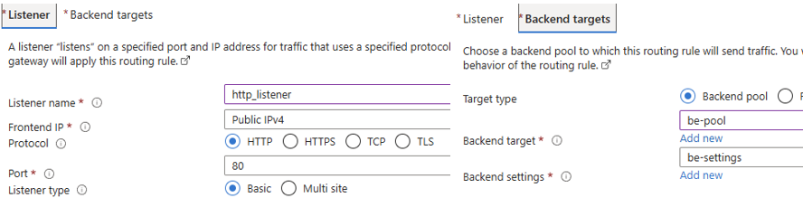
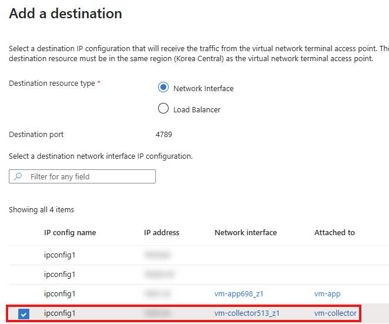
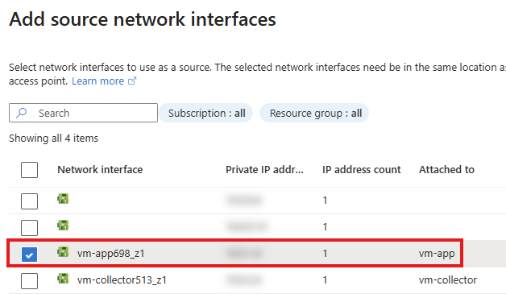
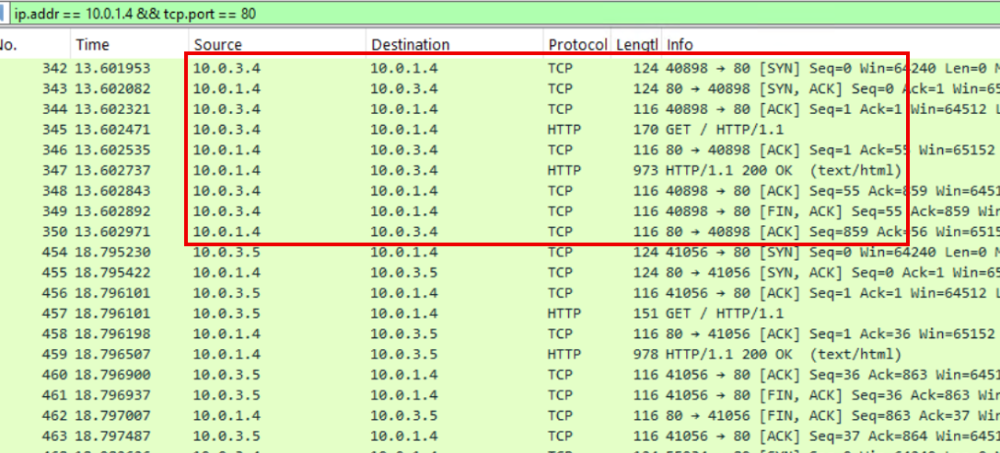

# Azure Virtual network TAP (vTAP) 실습
---

## Overview

- 이 데모에서는 **Azure Virtual Network TAP(vTAP)** 을 사용하여, 실제 애플리케이션 트래픽이 **패킷 미러링(Packet Mirroring)** 형태로 Collector VM으로 전달되는 동작을 확인합니다.

> ⚠️ **Preview 기능 안내**  
> Azure vTAP은 2026년 현재 **Preview 상태**의 기능이며, **Azure Korea Central Region** 또한 Preview 대상 리전에 포함됩니다.
따라서 SLA가 제공되지 않으며, 프로덕션 환경 적용 전 반드시 사전 검증(POC/데모)을 권장드립니다.
>
> 공식 문서: https://learn.microsoft.com/ko-kr/azure/virtual-network/virtual-network-tap-overview

- 아래 아키텍처에서는 **Application Gateway (L7 진입 지점)** 를 통해 유입된 HTTP 트래픽이 App VM으로 전달되고, 해당 트래픽이 vTAP을 통해 Collector VM으로 복제됩니다.

```
[Local PC / Terminal]
        |
        |  HTTP (curl)
        v
[Application Gateway]
        |
        v
[App VM (Nginx)]
        |
        |  (Mirrored by vTAP)
        v
[Collector VM (Wireshark)]
```

확인 포인트:
- Local 환경에서 발생한 실제 HTTP 요청
- Application Gateway → App VM 으로 전달되는 실트래픽
- App VM NIC 레벨에서 vTAP에 의해 복제되는 미러링 트래픽

---

## 1️⃣ 리소스 그룹 및 네트워크 구성

### ①-1. Resource Group 생성
- Resource groups → Create  
- Resource group name: `rg-vtap-lab`  
- Region: `(Asia Pacific) Korea Central`  
- Review + create → Create

### ①-2. Virtual Network 생성
- Virtual networks → Create  
- Name: `vnet-vtap-lab`  
- Address space: `10.0.0.0/16`  
- Subnets:
  - snet-app: `10.0.1.0/24`
  - snet-collector: `10.0.2.0/24`
  - snet-agw : `10.0.3.0/24`


> 💡 Subnet 구성 의도  
> - `snet-app` : Load Balancer Backend(App VM) 전용  
> - `snet-collector` : vTAP Destination(Collector VM) 전용  
> 역할 분리를 통해 트래픽 흐름과 데모 목적을 명확히 합니다.

---

## 2️⃣ 가상 머신 생성

### ②-1. App VM (Ubuntu)
- Virtual machines → Create  
- Name: `vm-app`  
- Image: Ubuntu Server 24.04 LTS  
- Size: Standard_D2as_v5  

**Networking 탭**
- Virtual network: `vnet-vtap-lab`
- Subnet: `snet-app`
- Public IP: Create new  
- NIC network security group: Basic  
- Allowed inbound ports: SSH (22)


### ②-2. App VM NSG – HTTP 80 허용
- vm-app → Networking settings → Create port rule → Inbound port rule  
- Destination port: 80  
- Action: Allow


### ②-3. Nginx 설치
- 생성한 vm-app SSH 접속 후 Nginx 를 설치합니다.
```bash
sudo apt update
sudo apt install -y nginx
sudo systemctl start nginx
```
- 설치 후 웹브라우저에서 VM Public IP를 호출하여, Nginx 구동 여부를 확인합니다.


### ②-4. Collector VM (Windows)
- Virtual machines → Create  
- Name: `vm-collector`  
- Image: Windows Server 2022 Datacenter  
- Size: Standard_D2as_v5  

**Networking 탭**
- Virtual network: `vnet-vtap-lab`
- Subnet: `snet-collector`
- Public IP: Create new  


- RDP 접속 후 Wireshark 설치

---

## 3️⃣ Application Gateway 구성
- 본 데모에서는 **Application Gateway** 를 사용합니다. 이는 L7 계층(HTTP) 기반 진입 지점을 보다 명확히 하고, 실제 고객 환경과 유사한 트래픽 흐름을 재현하기 위함입니다.

### ③-1. Application Gateway 생성
- Name: `agw-vtap-lab`
- Tier: Standard V2
- Virtual network: `vnet-vtap-lab`
- Subnet: `snet-agw (10.0.3.0/24)`

### ③-2. Backend Pool
- Backend target type/Target: `vm-app` Private IP 혹은 VM 등록
- Protocol: HTTP / Port 80

### ③-3. Routing Rules
- Listener Name : http_listener
- Frontend IP Protocol : HTTP
- Port : 80
- Listener type : Basic
- Backend targets : 위 생성한 Backend pool 등록



> 💡 Application Gateway는 L7에서 트래픽을 처리하지만,  
> vTAP은 **App VM NIC 기준**으로 동작하므로 Gateway 사용 여부와 무관하게 트래픽 미러링이 수행됩니다.
---

## 4️⃣ vTAP 구성
- 이 단계에서는 **vm-app NIC에서 수신/송신되는 트래픽을 복제**하여, **vm-collector(Collector VM) NIC로 미러링**되도록 vTAP을 구성합니다.  
- vTAP은 Application Gateway나 Load Balancer가 아니라, **VM의 NIC(Network Interface) 레벨**에서 동작합니다.

### ④-1. vTAP 리소스 생성

- 검색창에서 `Virtual network terminal access points` 검색 → Create

**Basics**
- Name: `vtap-app-to-collector`
- Region: Korea Central
- (Subscription / Resource group): `rg-vtap-lab`
- Destination IP address : Select destination resource 선택
    - Destination resource type : Network interface
    - Destination port : 4789
    - vm-collector NIC 선택 후 Select


**Source**
- Network Interface: `vm-app` NIC 선택 후 Add

> 💡 Destination port(기본 4789)는 “미러링 패킷을 Collector로 전달할 때 사용되는 전달 포트(캡슐화)”로 이해하시면 됩니다.  
> 이 값 자체가 ‘원본 HTTP 트래픽의 포트’(80)와는 무관합니다.

Review + Create → Create

---

## 5️⃣ Local 환경 테스트 및 분석

이 단계에서는 **Local PC → Application Gateway → App VM** 으로 전달되는 실제 트래픽과,  
해당 트래픽이 **vTAP을 통해 Collector VM으로 복제되는 과정**을 단계적으로 확인합니다.

### ⑤-1. Local PC 테스트

```bash
curl http://<Application_Gateway_Public_IP>
```

처리 흐름:
1. Local PC에서 HTTP 요청 생성
2. Application Gateway가 요청 수신
3. Backend Pool을 통해 vm-app 전달
4. vm-app(Nginx)에서 응답 반환

---

### ⑤-2. vTAP 동작 원리

- vTAP은 **로드밸런서/게이트웨이와 무관**하게 VM NIC에 직접 연결
- vm-app NIC에서 수신된 패킷을 복제
- 복제된 패킷은 VXLAN(UDP 4789) 형태로 Collector VM에 전달
- 원본 트래픽은 정상 처리되며 성능 영향 없음

---

### ⑤-3. Wireshark 분석

- `vm-collector` VM에서 미러링 패킷 분석을 위한 Wireshark 실행
- Capture Interface: Ethernet
- Display Filter 예시:
```
ip.addr == <vm-app Private IP> && tcp.port == 80
```
예) `agw-vtap-lab` 인스턴스 Private IP : `10.0.3.4` & `10.0.3.5`
`vm-app` Private IP : `10.0.1.4`

확인 내용:
- Application Gateway를 통해 유입된 HTTP 트래픽에 대해, Application Gateway 인스턴스 Private IP (`10.0.3.4`, `10.0.3.5`) → vm-app Private IP `(10.0.1.4)` 로 미러링 된 트래픽이 기록됨을 확인



---

## 6️⃣ 리소스 정리
- Resource groups → `rg-vtap-lab` → Delete resource group
